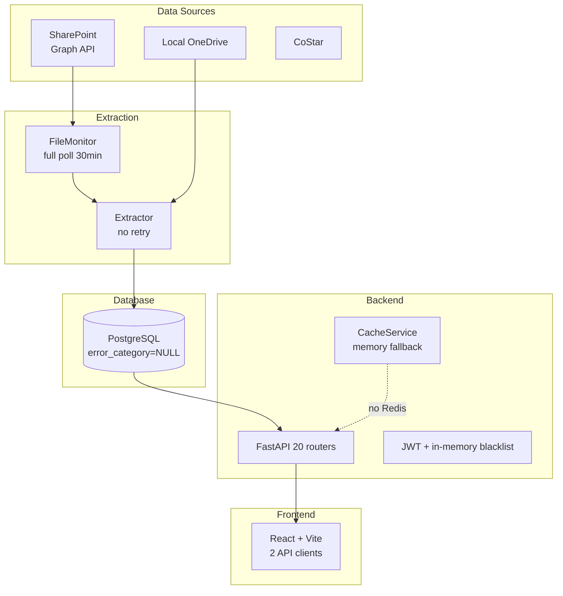
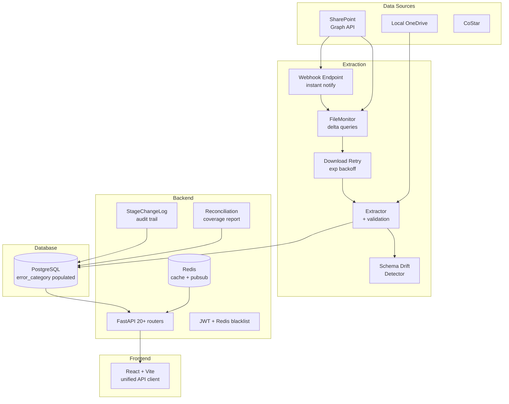

# Architecture Review v3 -- Executive Summary

**Date:** 2026-03-25 | **Branch:** `main` at `5bfc8d4` | **Prior Work:** v2 Review (69 findings), Tech Debt (62/76 resolved)

## Scope

Four workstreams analyzed 21 deliverable documents covering the full B&R Capital Dashboard stack: extraction pipeline, deal stage sync, data integrity, and general infrastructure.

| Metric | Value |
|--------|-------|
| Tests (backend + frontend) | 4,400+ |
| SQLAlchemy models | 30+ |
| API routers | 20 |
| Cell mappings | ~1,179 |
| Extracted values | 15,851 |
| Ungrouped files remaining | 28 (~25 deals) |

## Top 5 Critical Findings

1. **error_category never populated (WS4)** -- The column exists but is always NULL in production. No way to distinguish missing sheets from formula errors from cell-not-found issues without parsing logs.
2. **Redis configured but not enabled (WS1)** -- Token blacklist, rate limiter, and cache all silently degrade to in-memory. Lost on restart. User confirmed: enable now.
3. **No audit trail for deal stage changes (WS3)** -- Stage transitions from SharePoint sync, Kanban moves, and extraction are only logged to stdout. No DB persistence for compliance or debugging.
4. **Dual folder mapping with substring matching (WS3)** -- `_infer_deal_stage()` uses fragile substring matching. A deal named "Dead Creek" in Active Review would resolve to "dead". Two independent mapping dicts exist.
5. **Full poll every 30 min with zero retry (WS2)** -- ~200+ Graph API calls per cycle regardless of changes. No delta queries. Download failures are permanent with no retry logic.

## Architecture: Current vs Proposed

### Current State

### Proposed State

## Recommended Implementation Order

**WS4 (Data Integrity) -> WS1 (Infrastructure) -> WS2 (Extraction Automation) -> WS3 (Deal Stage Sync)**

Data integrity fixes (error_category, Tier 1b review) must come first because all other workstreams depend on trustworthy extraction data. Redis enablement unblocks WS2 (webhook debouncing, auth alerting) and WS3 (real-time notifications). Delta queries and retry logic in WS2 reduce API pressure before WS3 adds more sync complexity.

## Effort Estimate

| Sprint | Focus | Weeks |
|--------|-------|-------|
| Sprint 1 | P0: Data Integrity + Redis + Audit Trail | 1-2 |
| Sprint 2 | P0: Extraction Retry + Delta Queries + Security | 3-4 |
| Sprint 3 | P1: Webhooks + Ungrouped Files + Logging | 5-6 |
| Sprint 4 | P1/P2: Schema Drift + API Consolidation + Polish | 7-8 |

**Total: ~6-8 weeks (4 two-week sprints)**

## Unified Recommendation Count

| Priority | Count | Category |
|----------|-------|----------|
| P0 (Critical) | 10 | Must fix before production |
| P1 (Important) | 16 | Fix before or shortly after production |
| P2 (Nice to have) | 15 | Technical debt / backlog |
| **Total** | **41** | Deduplicated across all 4 workstreams |

See [UNIFIED-RECOMMENDATIONS.md](./UNIFIED-RECOMMENDATIONS.md) for the full catalog and [IMPLEMENTATION-ROADMAP.md](./IMPLEMENTATION-ROADMAP.md) for the sprint-level breakdown.
