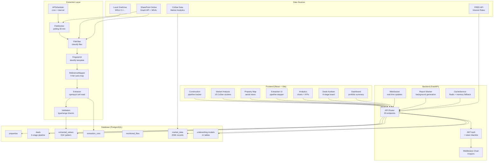
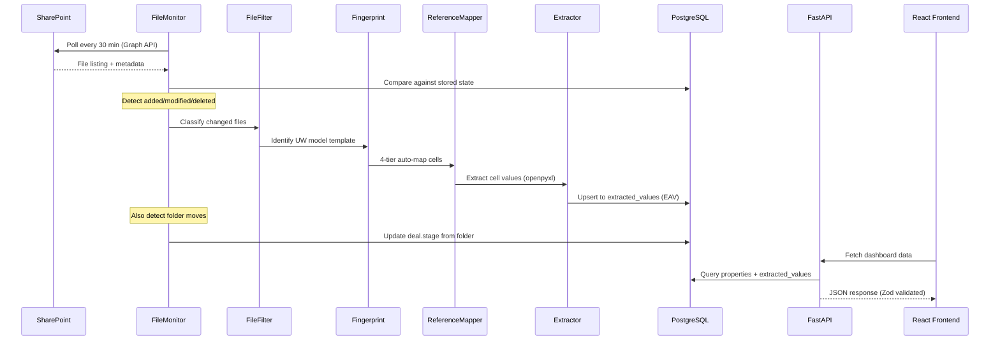
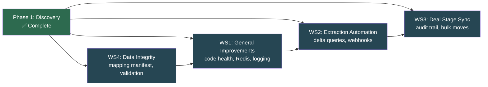

# Architecture Review — Discovery Summary

**Date:** 2026-03-25
**Branch:** `main` at `5bfc8d4`
**Baseline:** ~3,130 backend + ~1,274 frontend = **4,400+ tests**
**Prior Reviews:** Architecture Review v2 (69 findings), Dashboard Review (73 findings), Tech Debt (62/76 resolved)

---

## Architecture Diagram — Current State

## Data Flow — SharePoint → Dashboard

## Critical Findings & Risk Map

### P0 — Critical (Production Blockers)

| # | Finding | Impact | Source |
|---|---------|--------|--------|
| 1 | **F-001: Users endpoints use in-memory demo data** | Auth returns demo users in production | v2 review |
| 2 | **F-004: WebSocket token doesn't check blacklist** | Revoked tokens can still connect to WS | v2 review |
| 3 | **F-005: Frontend ignores refresh tokens** | Users must re-login when access token expires | v2 review |
| 4 | **F-007: Transaction DELETE only requires viewer role** | Any viewer can delete financial records | v2 review |
| 5 | **28 ungrouped files need mapping** | ~25 deals without extracted data | Extraction audit |
| 6 | **error_category column never populated** | No error categorization for debugging extraction failures | Schema audit |

### P1 — High (Should Fix Before Production)

| # | Finding | Impact | Source |
|---|---------|--------|--------|
| 7 | Mixed logging: loguru vs structlog | Inconsistent log format, no unified correlation | Code audit |
| 8 | No schema drift detection | Template changes silently break extraction | ETL audit |
| 9 | Redis code exists but not enabled by default | In-memory cache lost on restart, no pub/sub | Infra audit |
| 10 | Tier 3/4 mappings (confidence < 0.85) need manual review | Wrong cell → wrong financial data | ETL audit |
| 11 | No audit trail for deal stage changes | Only loguru logs, not persisted to DB | WS3 scope |
| 12 | `_infer_deal_stage()` uses string matching (fragile) | Folder rename → wrong stage assignment | Extraction audit |
| 13 | Two API clients in frontend | Maintenance burden, inconsistent patterns | Frontend audit |

### P2 — Medium (Technical Debt)

| # | Finding | Impact | Source |
|---|---------|--------|--------|
| 14 | Duplicate field name handling depends on row index | Reference file reorder breaks field names | ETL audit |
| 15 | No delta query support (full poll every 30 min) | Unnecessary API calls, latency | WS2 scope |
| 16 | deploy.yml workflow disabled (.disabled file remains) | CI/CD not operational | Infra audit |
| 17 | Some CHECK constraints only on new migrations | Older data may violate constraints | Schema audit |

## Key Metrics

| Metric | Value |
|--------|-------|
| Backend test functions | 3,130 |
| Frontend test files | 72 |
| Total tests | ~4,400+ |
| SQLAlchemy models | 30+ (across 17 files) |
| Alembic migrations | 20 |
| API routers | 20 |
| Middleware layers | 8 |
| Cell mappings | ~1,179 |
| Extracted values (last run) | 12,881 (initial) + 2,970 (groups) |
| Extraction groups completed | 9/9 deferred groups |
| Ungrouped files remaining | 28 |
| Market data records | 253K |

## Workstream Dependencies

**Execution order (confirmed):** WS4 → WS1 → WS2 → WS3

## Architecture Strengths

1. **EAV pattern for extracted values** — avoids 1,179-column table, makes new fields trivial
2. **4-tier auto-mapping** — handles template variants with confidence scoring
3. **Comprehensive middleware chain** — security headers, rate limiting, ETag, error handling, CORS, request ID
4. **Async throughout** — SQLAlchemy 2.0 async, aiohttp for SharePoint, FastAPI async endpoints
5. **Strong test coverage** — 4,400+ tests across backend and frontend
6. **CacheService graceful degradation** — Redis preferred, in-memory fallback transparent to callers
7. **Optimistic locking on Deal** — version column prevents concurrent update conflicts
8. **CHECK constraints on financial fields** — database-level data integrity for prices, rates, percentages
