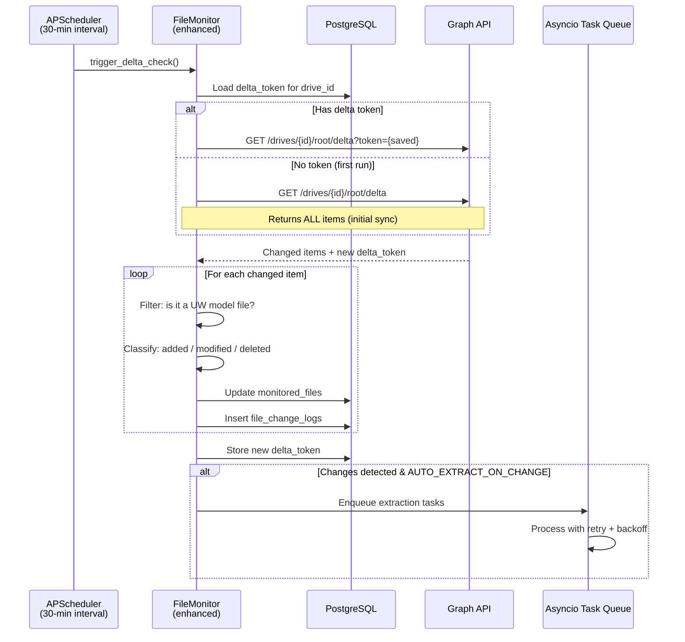
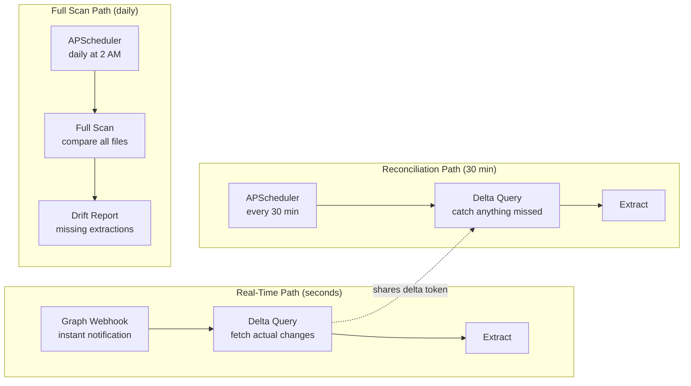
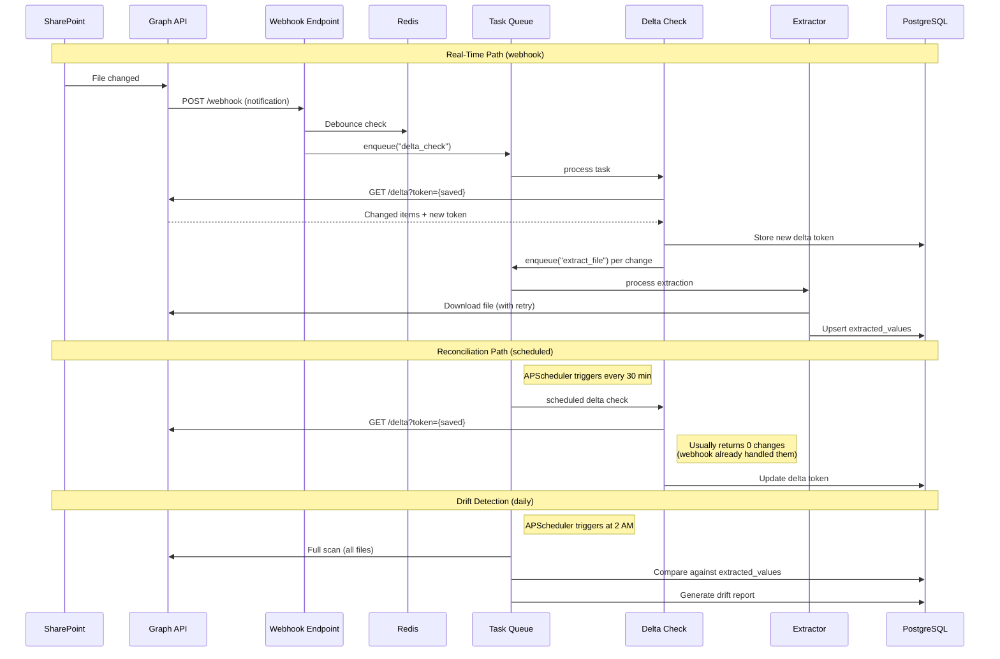

# WS2 Deliverable 3: Architecture Proposal — Hybrid Extraction Automation

**Workstream:** WS2 — Extraction Automation
**Date:** 2026-03-25
**Branch:** `main` at `5bfc8d4`
**Author:** Data Engineer Agent

---

## Design Principles

1. **Webhook for speed, polling for reliability**: Webhooks provide instant notification; delta polling provides guaranteed reconciliation.
2. **No new infrastructure dependencies beyond Redis**: No Celery, no RabbitMQ, no external queue. Use asyncio task queue + Redis for coordination.
3. **Single-server deployment**: Hetzner CX22 (2 vCPU, 4 GB RAM, public IP, $4.50/month).
4. **Backward compatible**: Existing polling mechanism continues to work. New features are additive.
5. **Incremental rollout**: Each phase can be deployed independently.

---

## Phase A: Delta Query Integration (Replace Full Poll)

### Overview

Replace the current full-scan polling with Graph API delta queries. Delta queries return only items that have changed since the last query, reducing API calls from O(folders x files) to O(changes).

### Graph API Delta Endpoint

```
GET /drives/{drive-id}/root/delta
GET /drives/{drive-id}/root/delta?token={deltaToken}
```

**Response structure:**
```json
{
    "@odata.nextLink": "https://graph.microsoft.com/v1.0/drives/{id}/root/delta?token=...",
    "@odata.deltaLink": "https://graph.microsoft.com/v1.0/drives/{id}/root/delta?token=...",
    "value": [
        {
            "id": "...",
            "name": "UW Model vCurrent.xlsb",
            "parentReference": { "path": "/drives/{id}/root:/Deals/4) Closed Deals/Copper Palms" },
            "lastModifiedDateTime": "2026-03-25T10:30:00Z",
            "size": 5242880,
            "@microsoft.graph.downloadUrl": "...",
            "deleted": { "state": "deleted" }  // only if deleted
        }
    ]
}
```

- **`@odata.nextLink`**: More pages available — follow this URL.
- **`@odata.deltaLink`**: All changes returned — store this token for next call.

### Delta Token Storage

New database table to persist delta tokens between application restarts:

```sql
CREATE TABLE delta_tokens (
    id UUID PRIMARY KEY DEFAULT gen_random_uuid(),
    drive_id VARCHAR(255) NOT NULL UNIQUE,
    delta_token TEXT NOT NULL,
    last_sync_at TIMESTAMPTZ NOT NULL DEFAULT now(),
    full_scan_at TIMESTAMPTZ,        -- last full reconciliation scan
    changes_since_full_scan INTEGER DEFAULT 0,
    created_at TIMESTAMPTZ NOT NULL DEFAULT now(),
    updated_at TIMESTAMPTZ NOT NULL DEFAULT now()
);
```

### Delta Query Flow



### Implementation Changes

**File: `backend/app/extraction/sharepoint.py`** — Add new method:

```python
async def get_delta_changes(
    self,
    delta_token: str | None = None,
) -> tuple[list[dict], str]:
    """
    Get changed items via Graph API delta query.

    Args:
        delta_token: Previous delta token, or None for initial sync.

    Returns:
        Tuple of (changed_items, new_delta_token)
    """
    drive_id = await self._get_drive_id()

    if delta_token:
        url = f"/drives/{drive_id}/root/delta?token={delta_token}"
    else:
        url = f"/drives/{drive_id}/root/delta"

    all_items = []
    while url:
        result = await self._make_request("GET", url)
        all_items.extend(result.get("value", []))

        # Follow nextLink for pagination
        next_link = result.get("@odata.nextLink")
        if next_link:
            url = next_link.replace(self.GRAPH_BASE_URL, "")
        else:
            url = None

    # Extract delta token from deltaLink
    delta_link = result.get("@odata.deltaLink", "")
    new_token = delta_link.split("token=")[-1] if "token=" in delta_link else ""

    return all_items, new_token
```

**File: `backend/app/services/extraction/file_monitor.py`** — Add delta-aware check:

```python
async def check_for_changes_delta(self) -> MonitorCheckResult:
    """
    Detect changes using Graph API delta queries instead of full scan.
    Falls back to full scan if delta token is missing or expired.
    """
    delta_token = await self._load_delta_token()

    try:
        changed_items, new_token = await self.client.get_delta_changes(delta_token)
        changes = self._classify_delta_items(changed_items)
        await self._save_delta_token(new_token)
        return changes
    except GraphApiError as e:
        if e.status == 410:  # Gone — delta token expired
            logger.warning("Delta token expired, falling back to full scan")
            await self._clear_delta_token()
            return await self.check_for_changes()  # existing full scan
        raise
```

### API Call Reduction

| Scenario | Current (full scan) | With delta queries |
|----------|--------------------|--------------------|
| No changes | ~200+ calls | 1 call |
| 1 file changed | ~200+ calls | 1-2 calls |
| 10 files changed | ~200+ calls | 1-2 calls |
| Initial sync | ~200+ calls | ~200+ calls (same) |
| Delta token expired (410) | N/A | Fallback to full scan |

---

## Phase B: Webhook Endpoint

### Overview

Add a webhook subscription to receive instant push notifications from Microsoft Graph when files change in the Deals drive. This eliminates the 30-minute polling delay for real-time responsiveness.

### Webhook Architecture

```mermaid
graph TB
    subgraph "Microsoft Graph"
        GRAPH_SUB[Subscription Service<br/>POST /subscriptions]
        GRAPH_NOTIFY[Notification Delivery<br/>POST to webhook URL]
    end

    subgraph "Hetzner CX22"
        NGINX[nginx reverse proxy<br/>TLS termination]
        WEBHOOK[POST /api/v1/extraction/webhook<br/>public endpoint]
        VALIDATE[Validation Handler<br/>echo validationToken]
        SIGNAL[Change Signal<br/>enqueue delta check]
        RENEW[Subscription Renewal<br/>APScheduler job<br/>every 2 days]
    end

    subgraph "Extraction Pipeline"
        DELTA[Delta Query<br/>get_delta_changes()]
        EXTRACT[Extraction Worker<br/>asyncio task queue]
    end

    GRAPH_SUB -->|validation request| NGINX
    NGINX --> WEBHOOK
    WEBHOOK --> VALIDATE
    WEBHOOK --> SIGNAL
    SIGNAL --> DELTA
    DELTA --> EXTRACT

    RENEW -->|PATCH /subscriptions/{id}| GRAPH_SUB
    GRAPH_NOTIFY -->|change notification| NGINX
```

### Webhook Endpoint Design

**New route:** `POST /api/v1/extraction/webhook`

This endpoint must be **publicly accessible** (no JWT auth) because Microsoft Graph sends notifications directly. Security is ensured via:

1. **Validation token echo** (Graph API handshake).
2. **Client state verification** (secret token in subscription).
3. **Request signature validation** (optional, via `clientState`).

```python
# backend/app/api/v1/endpoints/extraction/webhook.py

@router.post("/webhook", include_in_schema=False)
async def graph_webhook(
    request: Request,
    validationToken: str | None = Query(None),
):
    """
    Microsoft Graph webhook endpoint.

    Handles two types of requests:
    1. Validation: Graph sends validationToken, we echo it back as text/plain.
    2. Notification: Graph sends change data, we enqueue a delta check.
    """
    # Validation handshake
    if validationToken:
        return PlainTextResponse(
            content=validationToken,
            media_type="text/plain",
        )

    # Change notification
    body = await request.json()
    notifications = body.get("value", [])

    for notification in notifications:
        resource = notification.get("resource", "")
        client_state = notification.get("clientState", "")

        # Verify client state matches our secret
        if client_state != settings.GRAPH_WEBHOOK_SECRET:
            logger.warning("Invalid clientState in webhook notification")
            continue

        # Enqueue delta check (don't process inline — respond fast)
        await extraction_task_queue.enqueue(
            "delta_check",
            trigger="webhook",
            resource=resource,
        )

    # Must respond 202 within 3 seconds or Graph considers it failed
    return Response(status_code=202)
```

### Subscription Management

**New service:** `backend/app/services/extraction/webhook_manager.py`

```python
class WebhookSubscriptionManager:
    """Manages Graph API webhook subscriptions."""

    RESOURCE = "/drives/{drive_id}/root"
    CHANGE_TYPE = "updated"
    MAX_EXPIRY_MINUTES = 4230  # ~2.9 days (Graph API limit for drive items)
    RENEWAL_BUFFER_MINUTES = 60  # Renew 1 hour before expiry

    async def create_subscription(self) -> dict:
        """Create a new webhook subscription."""
        payload = {
            "changeType": self.CHANGE_TYPE,
            "notificationUrl": f"{settings.PUBLIC_BASE_URL}/api/v1/extraction/webhook",
            "resource": self.RESOURCE.format(drive_id=drive_id),
            "expirationDateTime": (
                datetime.now(UTC) + timedelta(minutes=self.MAX_EXPIRY_MINUTES)
            ).isoformat(),
            "clientState": settings.GRAPH_WEBHOOK_SECRET,
        }
        return await self.client._make_request("POST", "/subscriptions", json=payload)

    async def renew_subscription(self, subscription_id: str) -> dict:
        """Renew an existing subscription before it expires."""
        payload = {
            "expirationDateTime": (
                datetime.now(UTC) + timedelta(minutes=self.MAX_EXPIRY_MINUTES)
            ).isoformat(),
        }
        return await self.client._make_request(
            "PATCH", f"/subscriptions/{subscription_id}", json=payload
        )
```

### Subscription Renewal Schedule

Graph API subscriptions for drive items expire after a maximum of 4230 minutes (~2.9 days). An APScheduler job renews the subscription every 2 days:

```python
# In monitor_scheduler.py — add renewal job
RENEWAL_JOB_ID = "webhook_subscription_renewal"

trigger = IntervalTrigger(days=2)
scheduler.add_job(
    webhook_manager.renew_subscription,
    trigger=trigger,
    id=RENEWAL_JOB_ID,
    misfire_grace_time=3600,
)
```

### New Configuration Settings

```python
# In ExtractionSettings (config.py)
GRAPH_WEBHOOK_ENABLED: bool = False
GRAPH_WEBHOOK_SECRET: str = ""           # clientState for validation
PUBLIC_BASE_URL: str = ""                 # e.g., "https://dashboard.bandrcapital.com"
GRAPH_SUBSCRIPTION_ID: str | None = None  # Persisted subscription ID
```

---

## Hybrid Architecture: Webhook + Delta Polling

### How They Work Together



### Three-Tier Detection Strategy

| Tier | Trigger | Method | Latency | Purpose |
|------|---------|--------|---------|---------|
| 1 | Webhook | Delta query (triggered) | Seconds | Real-time response to changes |
| 2 | APScheduler (30 min) | Delta query (scheduled) | Minutes | Catch missed webhooks |
| 3 | APScheduler (daily) | Full scan + reconciliation | Hours | Drift detection, data integrity |

### Deduplication

Both webhook-triggered and poll-triggered delta checks use the same delta token. Redis provides coordination:

```python
# Prevent concurrent delta checks
async def acquire_delta_lock() -> bool:
    """Acquire Redis lock for delta check. Returns False if already locked."""
    return await redis.set(
        "extraction:delta_lock",
        value=str(datetime.now(UTC)),
        nx=True,    # Only set if not exists
        ex=300,     # Expire after 5 minutes (safety valve)
    )
```

If a webhook triggers a delta check while a scheduled poll is already running the delta check, the webhook request is debounced:

```python
async def enqueue_delta_check(trigger: str) -> None:
    """Enqueue a delta check, debouncing rapid webhook notifications."""
    # Debounce: if a check ran within the last 10 seconds, skip
    last_check = await redis.get("extraction:last_delta_check")
    if last_check and (datetime.now(UTC) - parse(last_check)).seconds < 10:
        logger.debug("Debouncing delta check", trigger=trigger)
        return

    await extraction_task_queue.enqueue("delta_check", trigger=trigger)
```

---

## Worker Implementation: Asyncio Task Queue

### Design Decision: No Celery

For a single-server deployment (Hetzner CX22), Celery + RabbitMQ adds unnecessary complexity. Instead, use an in-process asyncio task queue backed by Redis for persistence.

### Architecture

```python
# backend/app/services/extraction/task_queue.py

class ExtractionTaskQueue:
    """
    Asyncio-based task queue for extraction operations.

    Uses Redis list as a persistent queue with in-process workers.
    Tasks survive application restarts (Redis persistence).
    """

    QUEUE_KEY = "extraction:task_queue"
    PROCESSING_KEY = "extraction:processing"
    DEAD_LETTER_KEY = "extraction:dead_letter"
    MAX_RETRIES = 3

    def __init__(self, redis: Redis, max_workers: int = 2):
        self.redis = redis
        self.max_workers = max_workers
        self._workers: list[asyncio.Task] = []

    async def enqueue(self, task_type: str, **kwargs) -> str:
        """Add a task to the queue. Returns task ID."""
        task = {
            "id": str(uuid4()),
            "type": task_type,
            "params": kwargs,
            "created_at": datetime.now(UTC).isoformat(),
            "retry_count": 0,
        }
        await self.redis.rpush(self.QUEUE_KEY, json.dumps(task))
        return task["id"]

    async def _worker_loop(self, worker_id: int):
        """Worker loop: pull tasks from queue and process."""
        while True:
            # Blocking pop with timeout (BRPOPLPUSH for reliability)
            raw = await self.redis.brpoplpush(
                self.QUEUE_KEY,
                self.PROCESSING_KEY,
                timeout=30,
            )
            if raw is None:
                continue

            task = json.loads(raw)
            try:
                await self._process_task(task)
                await self.redis.lrem(self.PROCESSING_KEY, 1, raw)
            except Exception as e:
                await self._handle_failure(task, e, raw)

    async def _handle_failure(self, task: dict, error: Exception, raw: bytes):
        """Handle task failure with exponential backoff."""
        task["retry_count"] += 1
        task["last_error"] = str(error)

        if task["retry_count"] >= self.MAX_RETRIES:
            # Move to dead-letter queue
            await self.redis.rpush(self.DEAD_LETTER_KEY, json.dumps(task))
            logger.error(
                "Task moved to dead letter queue",
                task_id=task["id"],
                retries=task["retry_count"],
            )
        else:
            # Re-enqueue with exponential backoff delay
            delay = 2 ** task["retry_count"] * 30  # 60s, 120s, 240s
            task["retry_after"] = (
                datetime.now(UTC) + timedelta(seconds=delay)
            ).isoformat()
            await self.redis.rpush(self.QUEUE_KEY, json.dumps(task))
            logger.warning(
                "Task requeued with backoff",
                task_id=task["id"],
                retry=task["retry_count"],
                delay_seconds=delay,
            )

        await self.redis.lrem(self.PROCESSING_KEY, 1, raw)
```

### Task Types

| Task Type | Handler | Description |
|-----------|---------|-------------|
| `delta_check` | `handle_delta_check()` | Run delta query, classify changes, enqueue extractions |
| `extract_file` | `handle_extract_file()` | Download + extract a single file |
| `full_reconciliation` | `handle_reconciliation()` | Full scan + drift report |

---

## New Configuration Summary

```python
# Additions to ExtractionSettings in config.py

# Delta Query
DELTA_QUERY_ENABLED: bool = True
DELTA_RECONCILIATION_CRON: str = "0 2 * * *"  # Daily full scan for drift detection

# Webhook
GRAPH_WEBHOOK_ENABLED: bool = False   # Enable after Hetzner deployment
GRAPH_WEBHOOK_SECRET: str = ""
PUBLIC_BASE_URL: str = ""

# Redis Task Queue
EXTRACTION_QUEUE_MAX_WORKERS: int = 2
EXTRACTION_QUEUE_MAX_RETRIES: int = 3
EXTRACTION_QUEUE_DEAD_LETTER_TTL_DAYS: int = 7

# Download Resilience
DOWNLOAD_MAX_RETRIES: int = 3
DOWNLOAD_BACKOFF_BASE_SECONDS: int = 30
DOWNLOAD_TIMEOUT_SECONDS: int = 120
```

---

## Data Flow — Complete Hybrid Architecture



---

## Security Considerations

| Concern | Mitigation |
|---------|------------|
| Webhook endpoint is public | Validate `clientState` secret on every notification |
| Webhook replay attacks | Timestamp validation (reject notifications older than 5 minutes) |
| Graph API throttling | Debounce rapid webhook notifications; backoff on 429 responses |
| Redis data loss | Enable Redis AOF persistence for task queue durability |
| Download URL expiry | Refresh download URL on 403 response before retry |
| Client secret expiry | Health check endpoint reports days until Azure AD secret expires |

---

## Migration Path

| Phase | Description | Risk | Rollback |
|-------|-------------|------|----------|
| A1 | Add delta query method to SharePointClient | None | Delete method |
| A2 | Add delta_tokens table + Alembic migration | Low | Revert migration |
| A3 | Switch FileMonitor to delta-first, full-scan fallback | Low | Config flag to disable |
| B1 | Add webhook endpoint (no-op until subscription created) | None | Remove route |
| B2 | Add subscription manager + renewal job | Low | Delete subscription |
| B3 | Enable webhook in production | Medium | Disable via config |
| C1 | Add Redis task queue | Low | Fall back to inline processing |
| C2 | Add retry logic to downloads | None | Additive |
| C3 | Add dead-letter tracking | None | Additive |
