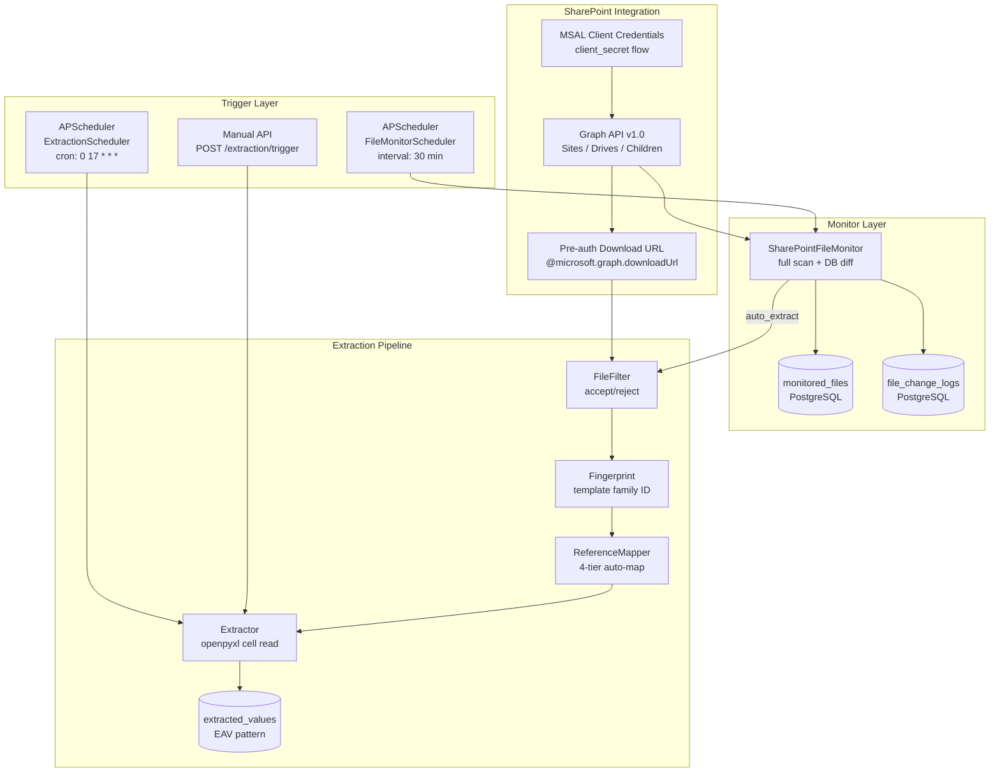

# WS2 Deliverable 1: Current State Assessment

**Workstream:** WS2 — Extraction Automation
**Date:** 2026-03-25
**Branch:** `main` at `5bfc8d4`
**Author:** Data Engineer Agent

---

## 1. SharePoint Client — MSAL Authentication

**File:** `backend/app/extraction/sharepoint.py` (lines 70-207)

### Auth Flow

The `SharePointClient` authenticates to Microsoft Graph API using MSAL's client credentials flow (app-only, no user context):

| Component | Detail | Line |
|-----------|--------|------|
| Library | `msal.ConfidentialClientApplication` | 168 |
| Flow | Client credentials (`acquire_token_for_client`) | 193 |
| Scope | `https://graph.microsoft.com/.default` | 191 |
| Authority | `https://login.microsoftonline.com/{tenant_id}` | 167 |
| Azure AD Permission | `Sites.Read.All` (application-level) | Confirmed by user |
| Auth type | `client_secret` (not certificate) | 100, 170 |

### Token Management

Token lifecycle is managed in `_get_access_token()` (line 175):

1. **Caching**: Token stored in `self._access_token` (in-memory, per-instance).
2. **Proactive refresh**: Token is refreshed when current time exceeds `token_expires - 5 minutes` (line 185).
3. **Expiry tracking**: `self._token_expires` set from `expires_in` response field (typically 3600s = 1 hour) (line 202).
4. **401 retry**: `_make_request()` handles 401 by clearing cached token and retrying once (lines 230-239).
5. **Error class**: `SharePointAuthError` raised on auth failure (line 198).

### HTTP Session Management

| Pattern | Detail | Line |
|---------|--------|------|
| Session type | `aiohttp.ClientSession` | 135 |
| Context manager | `async with SharePointClient() as client:` creates shared session | 133-140 |
| Fallback | Creates per-request session if no shared session exists | 158 |
| Session cleanup | `owns_session` flag tracks whether caller must close | 224, 243-245 |

### Site and Drive Resolution

Site ID and drive ID are resolved once and cached for the client lifetime:

1. `_get_site_id()` (line 247): Parses `SHAREPOINT_SITE_URL`, calls `/sites/{hostname}:{path}`.
2. `_get_drive_id()` (line 267): Lists drives at `/sites/{site_id}/drives`, matches by `library_name` (default: `"Real Estate"`). Falls back to default drive if library not found.

---

## 2. File Discovery Pipeline

**File:** `backend/app/extraction/sharepoint.py` (lines 300-578)

### Discovery Hierarchy

```
discover_deal_folders()           → list stage folders (e.g., "1) Initial UW and Review")
  └─ find_uw_models()            → iterate stage folders
       └─ _scan_deal_folder()    → for each deal folder:
            ├─ scan direct children (files in deal root)
            └─ scan UW Model subfolders (name contains "uw" or "model")
                 └─ _process_file_item()  → apply FileFilter, build SharePointFile
```

### Graph API Call Pattern (Full Scan)

Each polling cycle makes the following API calls:

| Step | Endpoint | Count |
|------|----------|-------|
| 1. List stage folders | `/drives/{id}/root:/{deals_folder}:/children` | 1 |
| 2. List deals per stage | `/drives/{id}/root:/{stage_path}:/children` | ~6 (one per stage) |
| 3. List files per deal | `/drives/{id}/root:/{deal_path}:/children` | N (one per deal) |
| 4. List UW subfolder files | `/drives/{id}/root:/{subfolder}:/children` | M (one per UW subfolder) |

**Total API calls per scan**: `1 + S + D + U` where S = stage folders (~6), D = deal folders (~100+), U = UW subfolders (~100+). Roughly **200+ API calls per full scan**.

### Deal Stage Inference

`_infer_deal_stage()` (line 662) uses substring matching on folder paths:

| Folder Pattern | Inferred Stage |
|---------------|----------------|
| `dead`, `passed` | `dead` |
| `initial uw`, `initial review` | `initial_review` |
| `active uw`, `active review` | `active_review` |
| `under contract` | `under_contract` |
| `closed`, `acquired` | `closed` |
| `realized` | `realized` |
| `archive` | `archive` |
| `pipeline`, `active` | `pipeline` |
| `loi` | `loi` |
| `due diligence`, `dd` | `due_diligence` |

**Fragility note**: The `active` keyword at line 691 matches broadly. Any folder path containing "active" that isn't caught by earlier patterns (lines 679-680) will be classified as `pipeline`. This is an ordering dependency.

### File Filtering

`_process_file_item()` (line 506) applies either:
- **FileFilter** (configurable, preferred): `file_filter.should_process(filename, size_bytes, modified_date)` (line 526).
- **Legacy regex** (fallback): `UW_MODEL_PATTERNS` list (lines 82-86) matching `.*UW Model.*\.xlsb$`, etc.

### Data Structures

| Dataclass | Fields | Purpose |
|-----------|--------|---------|
| `SharePointFile` | name, path, download_url, size, modified_date, deal_name, deal_stage | Accepted file metadata |
| `SkippedFile` | name, path, size, modified_date, skip_reason, deal_name | Rejected file with reason |
| `DiscoveryResult` | files, skipped, total_scanned, folders_scanned | Aggregated scan results |

---

## 3. File Monitor — Polling Mechanism

**File:** `backend/app/services/extraction/file_monitor.py` (lines 92-678)

### Architecture

| Component | Detail |
|-----------|--------|
| Class | `SharePointFileMonitor` |
| Detection | Polling — compare current SharePoint state vs. `monitored_files` table |
| State store | `MonitoredFile` model (PostgreSQL) |
| Audit trail | `FileChangeLog` model (PostgreSQL) |
| Logging | structlog with `component="FileMonitor"` binding |

### Change Detection Flow (`check_for_changes()`, line 119)

```
1. Discover current files from SharePoint (full scan via find_uw_models())
2. Load stored file states from monitored_files table
3. Detect changes by comparing current vs. stored:
   - ADDED:    path in SharePoint but not in DB
   - MODIFIED: path in both, but modified_date > stored OR size differs
   - DELETED:  path in DB but not in SharePoint
4. Update stored state (upsert monitored_files)
5. If AUTO_EXTRACT_ON_CHANGE: trigger extraction for added/modified files
6. Log all changes to file_change_logs audit trail
```

### Change Detection Logic (`_detect_changes()`, line 235)

| Change Type | Condition | Line |
|-------------|-----------|------|
| Added | `file.path not in stored_paths` | 256 |
| Deleted | `path in stored_paths - current_paths` | 276 |
| Modified | `file.modified_date > stored.modified_date OR file.size != stored.size_bytes` | 303-307 |

Datetime comparison uses `_ensure_aware()` (line 33) to normalize naive datetimes from SQLite test DB.

### State Update (`_update_stored_state()`, line 330)

For each file:
- **Existing**: Updates metadata (name, deal_name, size, modified_date, last_checked, deal_stage). Sets `extraction_pending=True` if modified since last extraction.
- **New**: Creates `MonitoredFile` with `extraction_pending=True`.
- **Deleted**: Sets `is_active=False`.

### Deal Stage Sync (`_sync_deal_stages()`, line 406)

When a file moves between stage folders, the monitor updates the corresponding `Deal.stage` in the database. Matches deals by name (exact or `"Name (City, ST)"` pattern). Added in commit `0d09ae7`.

### Auto-Extraction Trigger (`_trigger_extraction()`, line 544)

1. Filters to added/modified files only.
2. Creates an `ExtractionRun` via sync CRUD in a worker thread (`asyncio.to_thread`, line 574) to avoid event loop conflicts.
3. Checks for already-running extraction and skips if one exists (line 527).
4. Marks matching `MonitoredFile` records as `extraction_pending=True`.

---

## 4. Scheduler Configuration

### File Monitor Scheduler

**File:** `backend/app/services/extraction/monitor_scheduler.py` (lines 69-394)

| Component | Detail |
|-----------|--------|
| Class | `FileMonitorScheduler` |
| Engine | APScheduler `AsyncIOScheduler` |
| Trigger | `IntervalTrigger` (minutes-based) |
| Job ID | `"file_monitor_check"` |
| Misfire grace | 300 seconds (5 minutes) |
| Re-entrancy guard | `is_checking` flag prevents overlapping runs |
| Singleton | `get_monitor_scheduler()` factory |

### Extraction Scheduler

**File:** `backend/app/services/extraction/scheduler.py` (lines 64-399)

| Component | Detail |
|-----------|--------|
| Class | `ExtractionScheduler` |
| Engine | APScheduler `AsyncIOScheduler` |
| Trigger | `CronTrigger` (cron expression) |
| Default cron | `"0 2 * * *"` (daily at 2 AM) |
| Default timezone | `America/Phoenix` |
| Job ID | `"extraction_scheduled_run"` |
| Misfire grace | 3600 seconds (1 hour) |
| Re-entrancy guard | `running` flag prevents overlapping runs |
| Singleton | `get_extraction_scheduler()` factory |

### Scheduler Lifecycle

Both schedulers are initialized at application startup in `main.py`. They start in a paused state and resume only if their respective `*_ENABLED` setting is `True`.

---

## 5. Configuration Settings

**File:** `backend/app/core/config.py`

### Azure AD / SharePoint (ExternalServiceSettings, line 239)

| Setting | Type | Default | Purpose |
|---------|------|---------|---------|
| `AZURE_CLIENT_ID` | `str \| None` | `None` | Azure AD application (client) ID |
| `AZURE_CLIENT_SECRET` | `str \| None` | `None` | Azure AD client secret |
| `AZURE_TENANT_ID` | `str \| None` | `None` | Azure AD tenant ID |
| `SHAREPOINT_SITE_URL` | `str \| None` | `None` | SharePoint site URL |
| `SHAREPOINT_SITE` | `str \| None` | `"BRCapital-Internal"` | SharePoint site name |
| `SHAREPOINT_LIBRARY` | `str` | `"Real Estate"` | Document library name |
| `SHAREPOINT_DEALS_FOLDER` | `str` | `"Deals"` | Root deals folder path |

### Local Fallback (ExternalServiceSettings, line 248)

| Setting | Type | Default | Purpose |
|---------|------|---------|---------|
| `LOCAL_DEALS_ROOT` | `str` | `""` | Local OneDrive sync path for dev (e.g., `C:/Users/MattBorgeson/B&R Capital/...`) |

### File Monitor (ExtractionSettings, line 294)

| Setting | Type | Default | Purpose |
|---------|------|---------|---------|
| `FILE_MONITOR_ENABLED` | `bool` | `False` | Enable file monitoring service |
| `FILE_MONITOR_INTERVAL_MINUTES` | `int` | `30` | Polling interval in minutes |
| `AUTO_EXTRACT_ON_CHANGE` | `bool` | `True` | Trigger extraction on detected changes |
| `MONITOR_CHECK_CRON` | `str` | `"*/30 * * * *"` | Cron expression for monitor checks |

### Extraction Scheduler (ExtractionSettings, line 281)

| Setting | Type | Default | Purpose |
|---------|------|---------|---------|
| `EXTRACTION_SCHEDULE_ENABLED` | `bool` | `True` | Enable scheduled extraction runs |
| `EXTRACTION_SCHEDULE_CRON` | `str` | `"0 17 * * *"` | Cron expression (daily at 5 PM) |
| `EXTRACTION_SCHEDULE_TIMEZONE` | `str` | `"America/Phoenix"` | Timezone for cron schedule |

### Convenience Property (Settings, line 419)

```python
@property
def sharepoint_configured(self) -> bool:
    return all([
        self.AZURE_TENANT_ID,
        self.AZURE_CLIENT_ID,
        self.AZURE_CLIENT_SECRET,
        self.SHAREPOINT_SITE_URL,
    ])
```

---

## 6. Database State Models

**File:** `backend/app/models/file_monitor.py`

### MonitoredFile (line 32)

| Column | Type | Purpose |
|--------|------|---------|
| `id` | UUID PK | Primary key |
| `file_path` | String(500) UNIQUE | SharePoint file path (change detection key) |
| `file_name` | String(255) | Display name |
| `deal_name` | String(255) | Inferred deal name |
| `size_bytes` | BigInteger | File size for change detection |
| `modified_date` | DateTime(tz) | Last modified timestamp from SharePoint |
| `content_hash` | String(64) nullable | SHA-256 hash (column exists but unused in practice) |
| `first_seen` | DateTime(tz) | When file was first discovered |
| `last_checked` | DateTime(tz) | Last polling check timestamp |
| `last_extracted` | DateTime(tz) nullable | When last extracted |
| `is_active` | Boolean | False = file deleted from SharePoint |
| `extraction_pending` | Boolean | True = needs extraction |
| `extraction_run_id` | UUID FK nullable | Last extraction run |
| `deal_stage` | String(50) nullable | Inferred stage from folder |

### FileChangeLog (line 117)

| Column | Type | Purpose |
|--------|------|---------|
| `id` | UUID PK | Primary key |
| `file_path` | String(500) | File path |
| `file_name` | String(255) | Display name |
| `deal_name` | String(255) | Deal name |
| `change_type` | String(20) | `added`, `modified`, `deleted` |
| `old_modified_date` / `new_modified_date` | DateTime nullable | Before/after timestamps |
| `old_size_bytes` / `new_size_bytes` | BigInteger nullable | Before/after sizes |
| `detected_at` | DateTime(tz) | When change was detected |
| `extraction_triggered` | Boolean | Whether extraction was auto-triggered |
| `extraction_run_id` | UUID FK nullable | Associated extraction run |

---

## 7. File Download

**File:** `backend/app/extraction/sharepoint.py` (lines 595-660)

### `download_file()` (line 595)

1. Uses pre-authenticated `@microsoft.graph.downloadUrl` from discovery response.
2. If download URL is empty, fetches a fresh URL via `/drives/{id}/root:/{path}`.
3. Downloads via `aiohttp.ClientSession.get()` — **no retry logic** for download failures.
4. Returns raw bytes.

### `download_all_uw_models()` (line 631)

Sequential download of all discovered files. Each failure is logged and skipped — no retry, no backoff.

---

## 8. Summary of Current Architecture


