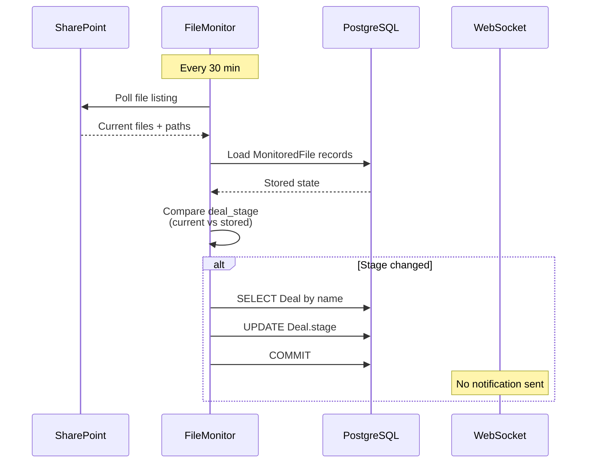
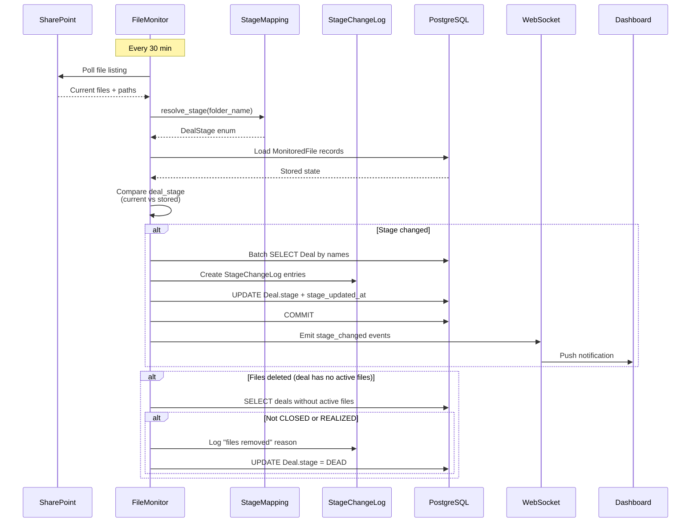

# WS3: Deal Stage Sync -- Architecture Proposal

**Date:** 2026-03-25
**Scope:** Design improvements for unidirectional (SharePoint -> DB) deal stage synchronization

---

## 1. Design Principles

1. **Single source of truth** -- One canonical mapping dict used everywhere, no duplicate logic.
2. **Audit everything** -- Every stage change is persisted with full context (who, what, when, why).
3. **Notify in real-time** -- Stage changes emit WebSocket events regardless of origin.
4. **Fail safely** -- Unknown folder names default to a safe state, not a wrong one.
5. **Unidirectional** -- SharePoint drives stage; dashboard can override with explicit reason.

---

## 2. Unified Folder Mapping

### 2.1 Canonical Mapping Module

Create a single mapping module that all code paths import:

**Proposed file:** `backend/app/services/extraction/stage_mapping.py`

```python
"""Canonical deal stage <-> SharePoint folder mapping.

Single source of truth for all stage inference and folder resolution.
"""

from app.models.deal import DealStage

# Forward mapping: SharePoint folder name -> DealStage
FOLDER_TO_STAGE: dict[str, DealStage] = {
    "0) Dead Deals": DealStage.DEAD,
    "1) Initial UW and Review": DealStage.INITIAL_REVIEW,
    "2) Active UW and Review": DealStage.ACTIVE_REVIEW,
    "3) Deals Under Contract": DealStage.UNDER_CONTRACT,
    "4) Closed Deals": DealStage.CLOSED,
    "5) Realized Deals": DealStage.REALIZED,
}

# Reverse mapping: DealStage -> SharePoint folder name
STAGE_TO_FOLDER: dict[DealStage, str] = {v: k for k, v in FOLDER_TO_STAGE.items()}

# Variant name aliases -> canonical DealStage
# These handle non-standard folder names (renames, shortcuts)
FOLDER_ALIASES: dict[str, DealStage] = {
    "dead deals": DealStage.DEAD,
    "passed deals": DealStage.DEAD,
    "passed": DealStage.DEAD,
    "initial uw": DealStage.INITIAL_REVIEW,
    "initial review": DealStage.INITIAL_REVIEW,
    "active uw": DealStage.ACTIVE_REVIEW,
    "active review": DealStage.ACTIVE_REVIEW,
    "under contract": DealStage.UNDER_CONTRACT,
    "deals under contract": DealStage.UNDER_CONTRACT,
    "closed deals": DealStage.CLOSED,
    "closed": DealStage.CLOSED,
    "acquired": DealStage.CLOSED,
    "realized deals": DealStage.REALIZED,
    "realized": DealStage.REALIZED,
}

def resolve_stage(folder_name: str) -> DealStage | None:
    """Resolve a folder name to a DealStage.

    1. Try exact match against canonical FOLDER_TO_STAGE.
    2. Try lowercase exact match against FOLDER_ALIASES.
    3. Return None if no match (caller decides default).
    """
    # Exact match first (canonical names)
    if folder_name in FOLDER_TO_STAGE:
        return FOLDER_TO_STAGE[folder_name]

    # Alias match (case-insensitive, against folder name only)
    name_lower = folder_name.lower().strip()
    if name_lower in FOLDER_ALIASES:
        return FOLDER_ALIASES[name_lower]

    return None
```

### 2.2 Replace _infer_deal_stage()

Replace the fragile substring matching with `resolve_stage()`:

```python
# In sharepoint.py
from app.services.extraction.stage_mapping import resolve_stage

def _infer_deal_stage(self, folder_path: str) -> str | None:
    """Infer deal stage from folder path."""
    # Extract the stage folder name (first component after Deals/)
    parts = folder_path.strip("/").split("/")
    for part in parts:
        stage = resolve_stage(part)
        if stage is not None:
            return stage.value
    return None
```

Key improvement: instead of matching substrings against the entire path, we match individual path components against the canonical mapping. This eliminates the deal-name-collision risk entirely.

### 2.3 Replace STAGE_FOLDER_MAP in common.py

```python
# In extraction/common.py
from app.services.extraction.stage_mapping import FOLDER_TO_STAGE

# Replace the old dict with a derived version
STAGE_FOLDER_MAP: dict[str, str] = {
    folder: stage.value for folder, stage in FOLDER_TO_STAGE.items()
}
```

---

## 3. Stage Change Audit Trail

### 3.1 StageChangeLog Model

**Proposed file:** `backend/app/models/stage_change_log.py`

```python
class StageChangeSource(StrEnum):
    """What triggered the stage change."""
    SHAREPOINT_SYNC = "sharepoint_sync"
    USER_KANBAN = "user_kanban"
    EXTRACTION_SYNC = "extraction_sync"
    MANUAL_OVERRIDE = "manual_override"
    SYSTEM = "system"

class StageChangeLog(Base, TimestampMixin):
    """Persisted audit trail of all deal stage changes."""

    __tablename__ = "stage_change_logs"

    id: Mapped[UUID] = mapped_column(PG_UUID(as_uuid=True), primary_key=True, default=uuid4)
    deal_id: Mapped[int] = mapped_column(Integer, ForeignKey("deals.id"), nullable=False, index=True)
    old_stage: Mapped[str | None] = mapped_column(String(50), nullable=True)
    new_stage: Mapped[str] = mapped_column(String(50), nullable=False)
    source: Mapped[str] = mapped_column(String(50), nullable=False)  # StageChangeSource value
    changed_by_user_id: Mapped[int | None] = mapped_column(Integer, ForeignKey("users.id"), nullable=True)
    reason: Mapped[str | None] = mapped_column(Text, nullable=True)  # For manual overrides
    metadata: Mapped[dict | None] = mapped_column(JSON, nullable=True)  # folder_path, etc.
    changed_at: Mapped[datetime] = mapped_column(DateTime(timezone=True), nullable=False)

    __table_args__ = (
        Index("idx_stage_change_log_deal_time", "deal_id", "changed_at"),
    )
```

### 3.2 Central Stage Change Function

All stage changes route through a single function that creates the audit record:

```python
async def change_deal_stage(
    db: AsyncSession,
    deal: Deal,
    new_stage: DealStage,
    source: StageChangeSource,
    changed_by_user_id: int | None = None,
    reason: str | None = None,
    metadata: dict | None = None,
) -> StageChangeLog:
    """Change a deal's stage with full audit trail and notification."""
    old_stage = deal.stage

    # Update the deal
    deal.stage = new_stage
    deal.stage_updated_at = datetime.now(UTC)

    # Create audit record
    log_entry = StageChangeLog(
        deal_id=deal.id,
        old_stage=old_stage.value if old_stage else None,
        new_stage=new_stage.value,
        source=source.value,
        changed_by_user_id=changed_by_user_id,
        reason=reason,
        metadata=metadata,
        changed_at=datetime.now(UTC),
    )
    db.add(log_entry)

    return log_entry
```

---

## 4. Stage Change Events via WebSocket

### 4.1 Event Emission

After `_sync_deal_stages()` updates deals, emit WebSocket notifications for each changed deal:

```python
async def _sync_deal_stages(self, stage_changes: list[tuple[str, str]]) -> int:
    # ... existing logic ...
    for deal in deals:
        if deal.stage != target_stage:
            log_entry = await change_deal_stage(
                self.db, deal, target_stage,
                source=StageChangeSource.SHAREPOINT_SYNC,
                metadata={"folder_path": folder_path},
            )
            updated += 1
            # Queue WebSocket notification
            ws_events.append({
                "deal_id": deal.id,
                "old_stage": log_entry.old_stage,
                "new_stage": log_entry.new_stage,
                "source": "sharepoint_sync",
            })

    if updated:
        await self.db.commit()
        # Emit all WebSocket events after commit
        ws_manager = get_websocket_manager()
        for event in ws_events:
            await ws_manager.notify_deal_update(
                deal_id=event["deal_id"],
                action="stage_changed",
                data=event,
            )
    return updated
```

### 4.2 Batch Event for Bulk Moves

When many deals change stage simultaneously (>5), emit a single batch event instead of N individual events:

```python
if len(ws_events) > 5:
    await ws_manager.broadcast({
        "type": "deals_bulk_stage_change",
        "count": len(ws_events),
        "new_stage": target_stage.value,
        "deal_ids": [e["deal_id"] for e in ws_events],
    })
```

---

## 5. Deletion Handling Policy

### Policy Decision: Mark as DEAD, Do Not Delete

When a deal's files disappear from SharePoint (all files for that deal marked `is_active=False`):

1. **Do not soft-delete the Deal.** The deal may still have value for historical analysis.
2. **Move to DEAD stage** if not already CLOSED or REALIZED.
3. **Log with source = "sharepoint_sync"** and reason = "All files removed from SharePoint."

### Implementation

After `_update_stored_state()` marks files inactive, check for deals that now have zero active files:

```python
# After marking deleted files inactive
orphaned_deals = await self._find_deals_without_active_files()
for deal in orphaned_deals:
    if deal.stage not in (DealStage.CLOSED, DealStage.REALIZED):
        await change_deal_stage(
            self.db, deal, DealStage.DEAD,
            source=StageChangeSource.SHAREPOINT_SYNC,
            reason="All files removed from SharePoint",
        )
```

Deals in CLOSED or REALIZED are protected -- these represent completed transactions and should not be automatically changed.

---

## 6. Bulk Move Batch Processing

### 6.1 Batch Query Optimization

Replace the N-query-per-deal pattern in `_sync_deal_stages()` with a single batch query:

```python
async def _sync_deal_stages(self, stage_changes: list[tuple[str, str]]) -> int:
    # Build all name conditions at once
    name_conditions = []
    name_to_stage: dict[str, DealStage] = {}
    for deal_name, new_stage_str in stage_changes:
        try:
            target = DealStage(new_stage_str)
        except ValueError:
            continue
        name_to_stage[deal_name.lower()] = target
        name_conditions.append(func.lower(Deal.name) == func.lower(deal_name))
        name_conditions.append(func.lower(Deal.name).like(func.lower(deal_name) + " (%"))

    if not name_conditions:
        return 0

    # Single query for all deals
    stmt = select(Deal).where(or_(*name_conditions), Deal.is_deleted.is_(False))
    result = await self.db.execute(stmt)
    all_deals = list(result.scalars().all())

    # Match and update
    updated = 0
    for deal in all_deals:
        deal_lower = deal.name.lower() if deal.name else ""
        for orig_name, target_stage in name_to_stage.items():
            if deal_lower == orig_name or deal_lower.startswith(f"{orig_name} ("):
                if deal.stage != target_stage:
                    await change_deal_stage(...)
                    updated += 1
                break

    if updated:
        await self.db.commit()
    return updated
```

---

## 7. Sync Flow Diagram

### Current State



### Proposed State



---

## 8. Frontend Alignment

### 8.1 Shared Constants API Endpoint

Expose the canonical mapping via API so the frontend can dynamically resolve folder names:

```
GET /api/v1/extraction/stage-mapping
```

Response:
```json
{
  "folder_to_stage": {
    "0) Dead Deals": "dead",
    "1) Initial UW and Review": "initial_review",
    ...
  },
  "stage_to_folder": {
    "dead": "0) Dead Deals",
    "initial_review": "1) Initial UW and Review",
    ...
  }
}
```

### 8.2 Frontend Migration

Replace hardcoded frontend mappings in:
- `src/features/deals/utils/sharepoint.ts` (lines 3-10)
- `src/components/quick-actions/QuickActionButton.tsx` (lines 76-83)

Either fetch from the API at startup or use a shared constants file generated from the backend mapping.

---

## 9. Stage Change History API

### 9.1 Endpoints

```
GET /api/v1/deals/{deal_id}/stage-history
```

Returns the full stage change timeline for a deal:

```json
[
  {
    "id": "uuid",
    "old_stage": "initial_review",
    "new_stage": "active_review",
    "source": "sharepoint_sync",
    "changed_by": null,
    "reason": null,
    "changed_at": "2026-03-15T10:30:00Z"
  },
  {
    "id": "uuid",
    "old_stage": "active_review",
    "new_stage": "dead",
    "source": "user_kanban",
    "changed_by": "matt@bandrcapital.com",
    "reason": null,
    "changed_at": "2026-03-20T14:00:00Z"
  }
]
```

### 9.2 Dashboard Widget

A timeline component in the Deal Detail Modal showing the stage change history:

```
[INITIAL_REVIEW] -----> [ACTIVE_REVIEW] -----> [DEAD]
  2026-03-01            2026-03-15               2026-03-20
  Extraction sync       SharePoint sync          User: matt@
```

---

## 10. Configuration

### New Settings

| Setting | Default | Purpose |
|---------|---------|---------|
| `STAGE_SYNC_DELETE_POLICY` | `mark_dead` | What to do when files are removed (mark_dead, ignore, soft_delete) |
| `STAGE_SYNC_PROTECT_CLOSED` | `true` | Prevent auto-stage-change for CLOSED/REALIZED deals |
| `STAGE_SYNC_NOTIFY_WEBSOCKET` | `true` | Emit WebSocket events for sync-originated changes |
| `STAGE_SYNC_BULK_THRESHOLD` | `5` | Number of changes above which a batch event is emitted |
