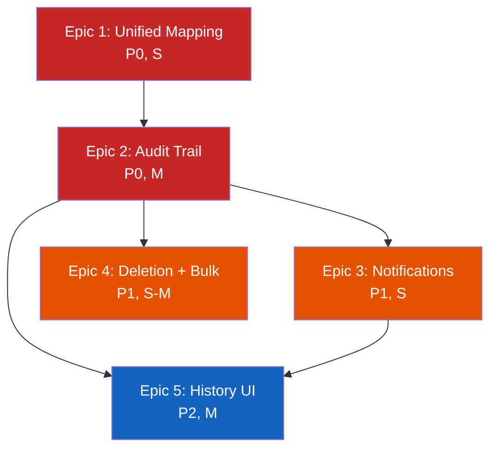

# WS3: Deal Stage Sync -- Implementation Plan

**Date:** 2026-03-25
**Format:** BMAD-style Epics -> Stories -> Tasks with T-shirt sizing
**Branch:** `ws3/deal-stage-sync` (from `main`)

---

## T-Shirt Sizing Reference

| Size | Time Estimate | Complexity |
|------|--------------|------------|
| XS | < 1 hour | Single file, few lines |
| S | 1-3 hours | Single feature, 2-3 files |
| M | 3-8 hours | Multi-file, new model/migration |
| L | 1-2 days | Cross-cutting, backend + frontend |
| XL | 2-5 days | Major refactor, many touchpoints |

---

## Epic 1: Unified Folder Mapping

**Priority:** P0
**Total Effort:** S (3-4 hours)
**Gaps Addressed:** G-02, G-06, G-09

### Story 1.1: Create Canonical Stage Mapping Module

**Size:** S

| # | Task | Size | Files |
|---|------|------|-------|
| 1.1.1 | Create `backend/app/services/extraction/stage_mapping.py` with `FOLDER_TO_STAGE`, `STAGE_TO_FOLDER`, `FOLDER_ALIASES`, and `resolve_stage()` | S | 1 new file |
| 1.1.2 | Write unit tests for `resolve_stage()`: exact match, alias match, unknown folder, case insensitivity, path component extraction | S | 1 new test file |

**Acceptance Criteria:**
- `resolve_stage("0) Dead Deals")` returns `DealStage.DEAD`
- `resolve_stage("Passed Deals")` returns `DealStage.DEAD` (alias)
- `resolve_stage("Unknown Folder")` returns `None`
- All 6 canonical mappings + all aliases covered by tests

### Story 1.2: Replace _infer_deal_stage() with resolve_stage()

**Size:** S

| # | Task | Size | Files |
|---|------|------|-------|
| 1.2.1 | Refactor `_infer_deal_stage()` in `sharepoint.py` to split path into components and call `resolve_stage()` on each | S | `backend/app/extraction/sharepoint.py` |
| 1.2.2 | Update existing tests in `test_sharepoint_integration.py` to match new behavior (path component matching vs substring) | S | `backend/tests/test_extraction/test_sharepoint_integration.py` |
| 1.2.3 | Add regression test: deal named "Dead Creek" in Active Review folder should resolve to `active_review`, not `dead` | XS | Same test file |

**Acceptance Criteria:**
- `_infer_deal_stage("Deals/2) Active UW and Review/Dead Creek Apartments")` returns `"active_review"` (not `"dead"`)
- All existing `_infer_deal_stage()` tests still pass (or are updated to reflect correct behavior)

### Story 1.3: Replace STAGE_FOLDER_MAP in common.py

**Size:** XS

| # | Task | Size | Files |
|---|------|------|-------|
| 1.3.1 | Replace hardcoded `STAGE_FOLDER_MAP` dict in `common.py` with import from `stage_mapping.py` | XS | `backend/app/api/v1/endpoints/extraction/common.py` |
| 1.3.2 | Verify `discover_local_deal_files()` still works with the derived mapping | XS | Run existing tests |

### Story 1.4: Fix Frontend Folder Names

**Size:** S

| # | Task | Size | Files |
|---|------|------|-------|
| 1.4.1 | Update `STAGE_FOLDER_MAP` in `src/features/deals/utils/sharepoint.ts` to match actual SharePoint folder names | XS | 1 file |
| 1.4.2 | Update `UW_STAGE_FOLDER_MAP` in `src/components/quick-actions/QuickActionButton.tsx` to match | XS | 1 file |
| 1.4.3 | Verify SharePoint URL generation produces correct paths | XS | Frontend test |

**Acceptance Criteria:**
- Frontend folder names match backend `STAGE_TO_FOLDER` exactly
- No duplicate mapping definitions remain in frontend

---

## Epic 2: StageChangeLog Audit Trail

**Priority:** P0
**Total Effort:** M (5-8 hours)
**Gaps Addressed:** G-01, G-03

### Story 2.1: Create StageChangeLog Model

**Size:** M

| # | Task | Size | Files |
|---|------|------|-------|
| 2.1.1 | Create `backend/app/models/stage_change_log.py` with `StageChangeLog` model and `StageChangeSource` enum | S | 1 new file |
| 2.1.2 | Register model in `backend/app/db/base.py` and `backend/app/models/__init__.py` | XS | 2 files |
| 2.1.3 | Create Alembic migration for `stage_change_logs` table | S | 1 new migration file |
| 2.1.4 | Write model unit tests (creation, field validation, index presence) | S | 1 new test file |

**Acceptance Criteria:**
- Migration runs cleanly on PostgreSQL and SQLite (tests)
- Model registers in both Alembic and app imports
- `stage_change_logs` table has index on `(deal_id, changed_at)`

### Story 2.2: Central change_deal_stage() Function

**Size:** S

| # | Task | Size | Files |
|---|------|------|-------|
| 2.2.1 | Create `change_deal_stage()` in `backend/app/services/deals/stage_service.py` (or inline in the model module) | S | 1 new file |
| 2.2.2 | Function must: update `deal.stage`, set `deal.stage_updated_at`, create `StageChangeLog` entry | S | Same file |
| 2.2.3 | Write unit tests: verify audit log creation, verify stage_updated_at is set, verify all StageChangeSource values work | S | 1 new test file |

**Acceptance Criteria:**
- Every call to `change_deal_stage()` creates exactly one `StageChangeLog` row
- `deal.stage_updated_at` is always updated
- Function works with all 5 source types

### Story 2.3: Retrofit Existing Stage-Change Callers

**Size:** M

| # | Task | Size | Files |
|---|------|------|-------|
| 2.3.1 | Retrofit `_sync_deal_stages()` in `file_monitor.py` to use `change_deal_stage()` with source `SHAREPOINT_SYNC` | S | `backend/app/services/extraction/file_monitor.py` |
| 2.3.2 | Retrofit `CRUDDeal.update_stage()` in `crud_deal.py` to use `change_deal_stage()` with source `USER_KANBAN` | S | `backend/app/crud/crud_deal.py` |
| 2.3.3 | Retrofit `_batch_update_deal_stages()` in `extraction.py` to use `change_deal_stage()` with source `EXTRACTION_SYNC` | S | `backend/app/crud/extraction.py` |
| 2.3.4 | Update pipeline endpoint in `deals/pipeline.py` to pass user_id to the central function | S | `backend/app/api/v1/endpoints/deals/pipeline.py` |
| 2.3.5 | Update all affected tests to verify StageChangeLog creation | M | Multiple test files |

**Acceptance Criteria:**
- No code path sets `deal.stage` directly (all go through `change_deal_stage()`)
- `stage_updated_at` is set for ALL stage changes (G-03 resolved)
- Test coverage confirms audit log entries for each source type
- Existing tests pass with minimal modification

### Story 2.4: Stage History API Endpoint

**Size:** S

| # | Task | Size | Files |
|---|------|------|-------|
| 2.4.1 | Create `GET /api/v1/deals/{deal_id}/stage-history` endpoint | S | `backend/app/api/v1/endpoints/deals/` (new or existing file) |
| 2.4.2 | Create Pydantic response schema for stage change entries | XS | `backend/app/schemas/` |
| 2.4.3 | Write endpoint tests (auth guard, pagination, empty history) | S | New test file |

**Acceptance Criteria:**
- Returns chronological list of stage changes for a deal
- Requires authentication (analyst role minimum)
- Supports pagination (limit/offset)

---

## Epic 3: Stage Change Notifications

**Priority:** P1
**Total Effort:** S (2-3 hours)
**Gaps Addressed:** G-04

### Story 3.1: WebSocket Notifications for Sync-Originated Changes

**Size:** S

| # | Task | Size | Files |
|---|------|------|-------|
| 3.1.1 | After `_sync_deal_stages()` commits, emit `ws_manager.notify_deal_update()` for each changed deal | S | `backend/app/services/extraction/file_monitor.py` |
| 3.1.2 | After `_batch_update_deal_stages()` commits, emit notifications | S | `backend/app/crud/extraction.py` |
| 3.1.3 | Implement batch event for bulk moves (>5 deals changed at once) | S | Same files |

**Acceptance Criteria:**
- WebSocket clients receive `stage_changed` events for SharePoint-sync changes
- Bulk moves (>5 deals) emit a single `deals_bulk_stage_change` event
- Events include `source` field to distinguish from user-initiated changes

### Story 3.2: Frontend Real-Time Stage Updates

**Size:** S

| # | Task | Size | Files |
|---|------|------|-------|
| 3.2.1 | Handle `stage_changed` events in Kanban board WebSocket listener | S | Frontend WebSocket hook or store |
| 3.2.2 | Show toast notification when a deal's stage is changed by sync | XS | Toast component |
| 3.2.3 | Refresh affected Kanban columns when batch event received | S | Kanban component |

**Acceptance Criteria:**
- Deals move between Kanban columns in real-time when synced from SharePoint
- User sees a non-intrusive notification for sync-originated changes
- Kanban board does not require manual refresh

---

## Epic 4: Deletion & Bulk Move Handling

**Priority:** P1
**Total Effort:** S-M (3-5 hours)
**Gaps Addressed:** G-07, G-08

### Story 4.1: Deletion Policy -- Mark DEAD When Files Removed

**Size:** S

| # | Task | Size | Files |
|---|------|------|-------|
| 4.1.1 | After `_update_stored_state()` marks files inactive, query for deals with zero active files | S | `backend/app/services/extraction/file_monitor.py` |
| 4.1.2 | For each orphaned deal not in CLOSED/REALIZED, call `change_deal_stage()` with reason | S | Same file |
| 4.1.3 | Add `STAGE_SYNC_DELETE_POLICY` setting (mark_dead or ignore) | XS | `backend/app/core/config.py` |
| 4.1.4 | Add `STAGE_SYNC_PROTECT_CLOSED` setting (default True) | XS | Same |
| 4.1.5 | Write tests: file removal triggers DEAD, CLOSED deals protected, setting respects "ignore" | M | Test file |

**Acceptance Criteria:**
- Deal moves to DEAD when all its files are removed
- CLOSED and REALIZED deals are never auto-changed
- Policy is configurable and defaults to `mark_dead`
- StageChangeLog records the deletion reason

### Story 4.2: Batch Query Optimization for _sync_deal_stages()

**Size:** S

| # | Task | Size | Files |
|---|------|------|-------|
| 4.2.1 | Refactor `_sync_deal_stages()` to collect all deal names and execute a single batch SELECT | S | `backend/app/services/extraction/file_monitor.py` |
| 4.2.2 | Match deals to target stages in-memory (same logic as `_batch_update_deal_stages()`) | S | Same file |
| 4.2.3 | Verify performance improvement with a test that passes 30 stage changes | S | Test file |

**Acceptance Criteria:**
- Only 1 SELECT query regardless of number of stage changes
- Behavior identical to current implementation (same test results)
- Single COMMIT for all updates

---

## Epic 5: Stage History UI

**Priority:** P2
**Total Effort:** M (5-8 hours)
**Gaps Addressed:** Visibility improvement, partial G-05 (conflict awareness)

### Story 5.1: Stage History Timeline Component

**Size:** M

| # | Task | Size | Files |
|---|------|------|-------|
| 5.1.1 | Create `StageHistoryTimeline` React component | M | New component file |
| 5.1.2 | Style with source-specific icons (user, SharePoint, system) | S | Same file |
| 5.1.3 | Create API hook: `useStageHistory(dealId)` | S | New hook file |
| 5.1.4 | Add Zod schema for stage history response | XS | Schema file |
| 5.1.5 | Write component tests | S | Test file |

**Acceptance Criteria:**
- Timeline shows chronological stage changes with timestamps
- Each entry shows source (icon) and optional reason
- Lazy-loaded (only fetches when section is expanded)

### Story 5.2: Integrate into Deal Detail Modal

**Size:** S

| # | Task | Size | Files |
|---|------|------|-------|
| 5.2.1 | Add collapsible "Stage History" section to Deal Detail Modal | S | Deal detail component |
| 5.2.2 | Follow same pattern as Proforma Returns section (lazy collapsible) | XS | Same |

### Story 5.3: Manual Override with Reason

**Size:** S

| # | Task | Size | Files |
|---|------|------|-------|
| 5.3.1 | Add optional `reason` field to stage update API request schema | XS | `backend/app/schemas/deal.py` |
| 5.3.2 | Pass `reason` through to `change_deal_stage()` in pipeline endpoint | XS | `backend/app/api/v1/endpoints/deals/pipeline.py` |
| 5.3.3 | Show sync conflict warning in Kanban when deal was recently auto-synced | S | Frontend Kanban component |
| 5.3.4 | Add confirmation dialog: "This deal's stage was updated by SharePoint sync 2 hours ago. Continue?" | S | Dialog component |

**Acceptance Criteria:**
- Users can provide a reason when changing stage via Kanban
- Warning shown if deal was synced from SharePoint within 24 hours
- Reason stored in StageChangeLog

---

## Execution Summary

| Epic | Stories | Total Effort | Priority | Dependencies |
|------|---------|-------------|----------|--------------|
| 1: Unified Folder Mapping | 4 | S (3-4h) | P0 | None |
| 2: StageChangeLog Audit Trail | 4 | M (5-8h) | P0 | Epic 1 (for resolve_stage) |
| 3: Stage Change Notifications | 2 | S (2-3h) | P1 | Epic 2 (for change_deal_stage) |
| 4: Deletion & Bulk Move | 2 | S-M (3-5h) | P1 | Epic 2 |
| 5: Stage History UI | 3 | M (5-8h) | P2 | Epics 2 + 3 |
| **Total** | **15** | **~20-28h** | | |

---

## Dependency Graph

---

## Testing Strategy

| Epic | Backend Tests | Frontend Tests | Integration Tests |
|------|-------------|---------------|------------------|
| 1 | resolve_stage() unit tests, _infer_deal_stage() regression | SharePoint URL generation | Local + SharePoint discovery |
| 2 | StageChangeLog CRUD, change_deal_stage(), retrofit callers | - | API endpoint tests |
| 3 | WebSocket emission verification | Event handling, toast display | End-to-end: folder move -> WS event -> UI update |
| 4 | Deletion policy, batch query, CLOSED protection | - | File removal -> stage change |
| 5 | Stage history endpoint, pagination | Timeline component, dialog | - |

**Estimated new tests:** ~40-60 across all epics

---

## Rollback Plan

Each epic is independently deployable:
- **Epic 1:** If `resolve_stage()` has issues, revert to inline `STAGE_FOLDER_MAP` (the old code still works, just duplicated)
- **Epic 2:** StageChangeLog is additive (new table, new function). If issues arise, callers can revert to direct `deal.stage =` assignment
- **Epic 3:** WebSocket notifications are fire-and-forget; disabling is a config toggle
- **Epic 4:** Deletion policy controlled by setting (`STAGE_SYNC_DELETE_POLICY = ignore` to disable)
- **Epic 5:** UI-only; no backend changes required to roll back
